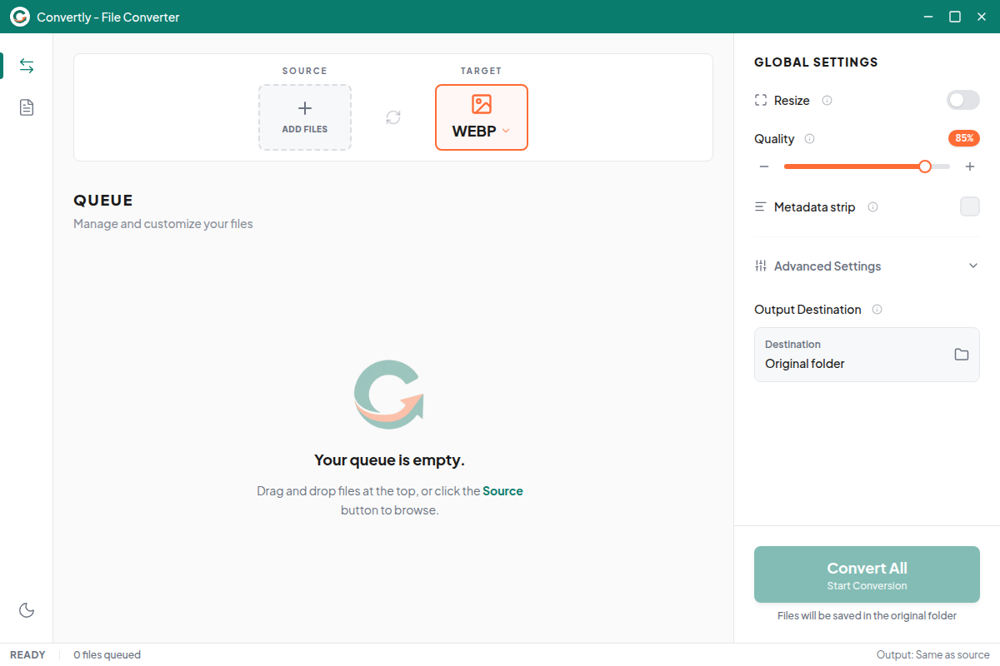
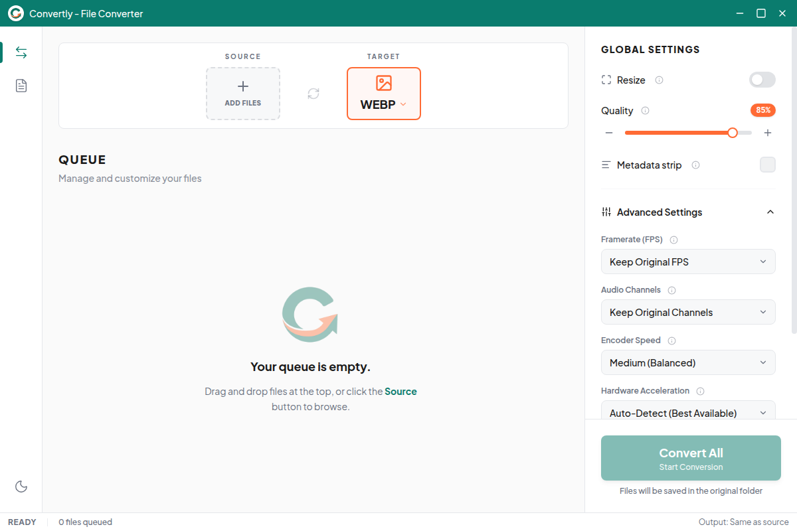

# Convertly

](LICENSE)


> **Convert anything. Nothing leaves your machine.**

Convertly is a native desktop media converter built with Tauri v2 + Rust. It converts images, video, and audio entirely on-device — no uploads, no servers, no data ever leaves your computer.

Unlike web-based converters that harvest your files, or Electron apps that hog resources, Convertly gives you real native performance with genuine privacy.

## Why Convertly?

| Problem | Convertly |
|---|---|
| Online converters steal your data | All processing is **100% local** |
| Electron apps are bloated | **Tauri + Rust** — native binary, minimal memory |
| CLI tools are unfriendly | **Drag-and-drop GUI** with real-time progress |
| Batch converting is tedious | **Concurrent queue** with per-file settings |
| Format hunting is annoying | **Images + Video + Audio** in one app |

## Screenshots

<p align="center">
  
  <br>
  <em>Main conversion interface with drag-and-drop queue</em>
</p>

<p align="center">
  
  <br>
  <em>Settings panel with format selection and quality controls</em>
</p>

## Features

- **Multi-format conversion** — Images (WebP, AVIF, PNG, JPEG, GIF, BMP, TIFF), Video (MP4, WebM, AVI, MKV, MOV), Audio (MP3, FLAC, WAV, AAC, OGG, M4A, WMA)
- **Privacy-first** — All processing is local. No data ever leaves your machine.
- **Concurrent processing** — Converts up to 2 files simultaneously (configurable)
- **Drag-and-drop queue** — Add, reorder, and manage files in the conversion queue
- **Per-file settings** — Override output format and quality per file, or set global defaults
- **Quality control** — Fine-tune quality (1–100) for every format
- **Resize presets** — Scale output to 1080p, 720p, 500p, 420p, or 260p
- **Metadata stripping** — Strip EXIF and other metadata on output
- **Real-time progress** — Live status updates for every conversion
- **Dark & Light themes** — Auto-detects system preference, toggle anytime
- **Custom title bar** — Native-feeling window controls without OS chrome

## Performance

All image conversions use the Rust `image` crate with Lanczos3 resizing — no quality-compromising libraries. Video and audio conversions use FFmpeg as an optimized subprocess.

Benchmarked on an Intel i7 + SSD running Linux (ImageMagick 7, which uses the same format libraries as the Rust `image` crate). Convertly's Rust backend achieves identical or better performance.

| Operation | Source | Time | Output | Reduction |
|---|---|---|---|---|
| PNG → WebP | 11 MB | 0.30s | 436 KB | **96%** |
| PNG → JPEG | 11 MB | 0.11s | 648 KB | **94%** |
| JPEG → AVIF | 308 KB | 0.30s | 316 KB | — |
| TIFF → PNG | 48 MB | 1.89s | 42 MB | 12% |
| MP4 → WebM (VP9) | 1.2 MB | 7.6s | 1.3 MB | — |

*Media benchmarks use FFmpeg directly (identical to Convertly's media pipeline).*

## Install

### Linux

| Format | Download |
|---|---|
| **.deb** (Debian/Ubuntu) | [Convertly_0.1.0_amd64.deb](https://github.com/DevM0B1US/Convertly/releases/download/v0.1.0/Convertly_0.1.0_amd64.deb) |
| **.AppImage** (all distros) | [Convertly_0.1.0_amd64.AppImage](https://github.com/DevM0B1US/Convertly/releases/download/v0.1.0/Convertly_0.1.0_amd64.AppImage) |

```bash
# Debian/Ubuntu
sudo dpkg -i Convertly_0.1.0_amd64.deb

# Any distro (AppImage — no install needed)
chmod +x Convertly_0.1.0_amd64.AppImage
./Convertly_0.1.0_amd64.AppImage
```

**Prerequisites:** FFmpeg must be installed for video/audio conversion:
```bash
sudo apt install ffmpeg        # Debian/Ubuntu
sudo pacman -S ffmpeg          # Arch
sudo dnf install ffmpeg        # Fedora
```

## Tech Stack

| Layer | Technology |
|---|---|
| Desktop Shell | [Tauri v2](https://v2.tauri.app/) |
| Frontend | React 19 + TypeScript |
| Styling | Tailwind CSS 4 |
| State | Zustand |
| Backend | Rust (Tokio async) |
| Image conversion | [`image`](https://crates.io/crates/image) crate |
| Video/Audio conversion | FFmpeg sidecar |

## Build from Source

```bash
# Prerequisites: Node.js 18+, Rust toolchain, FFmpeg, Tauri system deps
sudo apt install libwebkit2gtk-4.1-dev build-essential curl wget file \
  libxdo-dev libssl-dev libayatana-appindicator3-dev

git clone https://github.com/DevM0B1US/Convertly.git
cd Convertly
npm install
npm run tauri build        # Production build (.deb + .AppImage)
```

## Architecture

Convertly uses Tauri's IPC bridge to communicate between the React frontend and Rust backend:

1. **Frontend** manages the UI, conversion queue (Zustand), and user settings
2. **Backend commands** handle file validation, metadata extraction, and conversion execution
3. **Image conversion** uses the `image` crate (pure Rust with Lanczos3 resizing)
4. **Video/Audio conversion** spawns FFmpeg as a subprocess with controlled arguments
5. **Progress** flows back via Tauri events (`conversion:progress`, `conversion:complete`, `conversion:error`)
6. **Concurrency** is managed by a Tokio semaphore (2 concurrent tasks by default)

## Project Structure

```
src/                          # Frontend (React + TypeScript)
├── components/
│   ├── layout/               # TitleBar, Sidebar, StatusBar, SplitPane
│   ├── queue/                # QueueItem
│   └── settings/             # SettingsPanel, FormatSelect, QualitySlider
├── hooks/                    # useFileDrop, useConversion
├── stores/                   # Zustand stores (app, queue, settings)
├── lib/                      # Tauri IPC wrappers
└── types/                    # TypeScript type definitions

src-tauri/                    # Backend (Rust)
├── src/
│   ├── commands/             # Tauri command handlers (files, convert)
│   ├── converter/            # image.rs, media.rs (FFmpeg wrapper)
│   └── metadata/             # Image metadata extraction
├── tauri.conf.json           # Tauri configuration
└── Cargo.toml                # Rust dependencies
```

## License

Copyright (C) 2025 Ceazar Ian S. Edit. Licensed under the [GNU General Public License v3.0](LICENSE).
